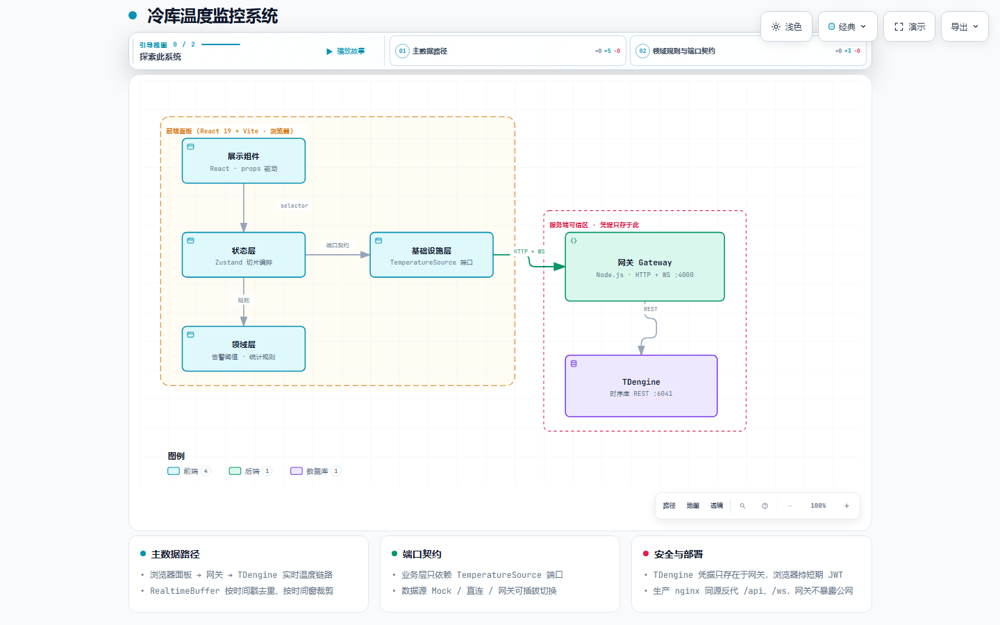

# 冷库温度监控系统 · 前端使用与对接文档

> 面向需要接入、改造或二次开发本项目的开发者。
> 文档覆盖：环境搭建、数据源对接、配置项、网关通信协议、部署方式与常见问题。

---

## 1. 项目简介

冷链/冷库温度监控面板，采用**前后端分离 + 后端网关**的工业化架构：

- **前端**（本仓库根目录）：React 19 + Vite 8 + TypeScript，Zustand 状态管理，ECharts 趋势图
- **后端网关**（`server/`）：Node.js + TypeScript，JWT 鉴权、TDengine 查询代理、WebSocket 实时推送
- **数据源**：TDengine 时序数据库（生产），Mock 模拟（演示/开发），均可插拔切换

```
┌────────────┐     HTTP+WS(同源或跨域)    ┌──────────────┐   TDengine REST   ┌──────────────┐
│  前端 React │ ─────────────────────────▶ │  网关 Gateway │ ────────────────▶ │  TDengine    │
│  (浏览器)   │ ◀───────────────────────── │  :4000       │ ◀──────────────── │  :6041       │
└────────────┘   JWT / snapshot / point    └──────────────┘   凭据只在服务端   └──────────────┘
```

**交互式架构图**（支持明暗主题、缩放、搜索、焦点、关系追踪、语义视图与导出）：

<a href="docs/architecture.html" title="打开交互式架构图（在新窗口）">
  
</a>

> 亮色预览为 1440×900 截图；打开 [architecture.html](docs/architecture.html) 可查看可交互的完整版本。

核心设计原则：

1. **领域规则单点定义**：温度配色、统计计算收敛在 `src/domain/`，禁止在组件/数据源里再写死
2. **端口契约（ISP）**：业务层只依赖 `TemperatureSource` 接口，不感知具体数据源实现
3. **凭据下沉**：TDengine 凭据只存在于网关服务端，浏览器只持有短期 JWT
4. **实时与历史合并**：`RealtimeBuffer` 按时间戳去重、按时间窗裁剪，避免图表重复点/截断

---

## 2. 快速开始

### 2.1 环境要求

| 依赖 | 版本 | 说明 |
| --- | --- | --- |
| Node.js | ≥ 22 | 前后端均需（`fetch`、`AbortSignal.timeout` 依赖新版本） |
| npm | ≥ 10 | |
| Docker + Compose（可选） | - | 仅生产部署需要 |

### 2.2 安装依赖

```bash
# 前端依赖（仓库根目录）
npm install

# 后端网关依赖
cd server && npm install && cd ..
```

### 2.3 启动开发环境

**① 启动后端网关**（默认 `http://localhost:4000`）

```bash
cd server
npm run dev        # tsx watch，改代码自动重启
```

**② 启动前端**（默认 `http://localhost:3000`，被占用会自动递增端口）

```bash
npm run dev
```

启动前请按第 5 章配置好 `.env`。默认使用 `VITE_DATA_SOURCE=gateway` 直连网关。

### 2.4 常用命令（前端）

```bash
npm run dev        # 开发服务器
npm run build      # tsc 类型检查 + vite 生产构建
npm run lint       # ESLint 检查
npm test           # Vitest 单元测试（9 个用例）
```

常用命令（网关）

```bash
cd server
npm run dev        # 开发（热重载）
npm run start      # 直接运行
npm run typecheck  # 类型检查
```

---

## 3. 目录结构

```
temperature_control_panel/
├── src/
│   ├── domain/                  # ★ 领域层：业务规则与数据契约（纯函数，可单测）
│   │   ├── temperature.ts       #   温度点类型
│   │   ├── temperatureColor.ts  #   温度展示配色（纯视觉，无业务判定）
│   │   └── stats.ts             #   最高/最低/平均温统计
│   ├── infrastructure/          # ★ 基础设施层：数据源实现
│   │   ├── ports.ts             #   端口契约（QueryPort / RealtimePort / TemperatureSource）
│   │   ├── factory.ts           #   数据源工厂（按配置返回实现）
│   │   ├── MockTemperatureSource.ts       #   模拟数据源（演示/开发）
│   │   ├── GatewayTemperatureSource.ts    # ★ 网关数据源（JWT + WebSocket）
│   │   └── RealtimeBuffer.ts    #   实时/历史合并缓冲
│   ├── stores/                  # ★ 状态层：Zustand 状态切片
│   │   ├── temperatureStore.ts  #   主数据编排（init/dispose/refreshHistory）
│   │   ├── connectionStore.ts   #   连接状态 + 数据源名
│   │   └── timeRangeStore.ts    #   历史时间范围（1H/6H/24H）
│   ├── config/index.ts          # ★ 环境变量校验(zod) + 数据源选择 + 连接配置
│   ├── components/              # 展示组件（纯 props 驱动）
│   │   ├── Header.tsx / MainTemperature.tsx / HistoryChart.tsx
│   │   ├── StatusCards.tsx / ParticleBackground.tsx
│   ├── App.tsx                  # 入口编排（读 store → 传 props）
│   └── main.tsx
├── server/                      # ★ 后端网关
│   ├── src/
│   │   ├── main.ts              #   启动入口
│   │   ├── config.ts            #   环境变量校验(zod)
│   │   ├── domain/              #   服务端契约（与前端对齐）
│   │   ├── core/tdengine.ts     #   TDengine REST 客户端
│   │   ├── http/                #   HTTP 路由 + JWT 鉴权
│   │   └── ws/realtime.ts       #   WebSocket 实时推送
│   └── .env                     #   网关配置（凭据/端口）
├── tests/                       # Vitest 单测
├── Dockerfile / docker-compose.yml / nginx.conf   # 生产部署
└── .env                         # 前端环境变量
```

---

## 4. 核心架构与数据流

### 4.1 分层职责

| 层 | 目录 | 职责 | 禁止事项 |
| --- | --- | --- | --- |
| 展示层 | `components/` | 纯 UI，props 驱动 | 不直接调 fetch，不写业务规则 |
| 状态层 | `stores/` | 状态切片 + 数据编排 | 不写领域规则 |
| 领域层 | `domain/` | 纯函数业务规则 | 不依赖 React / 网络 |
| 基础设施 | `infrastructure/` | 数据源/缓冲实现 | 不写 UI 逻辑 |

### 4.2 数据流

```
App 挂载
  └─ temperatureStore.init()
       ├─ factory.createSource()     按配置创建数据源
       ├─ source.connect(config)     登录/建连（网关：登录→换票→WS→快照）
       ├─ source.getCurrent()        取当前温度
       ├─ source.subscribe(cb)       实时点 → buffer.push → 更新 history/current
       └─ refreshHistory(rangeMs)    调 getHistory → buffer.seed
```

时间范围切换（1H/6H/24H）→ `timeRangeStore.rangeMs` → `refreshHistory` 重新拉取历史并重建缓冲。

---

## 5. 环境变量配置

### 5.1 前端 `.env`（仓库根目录）

| 变量 | 默认值 | 说明 |
| --- | --- | --- |
| `VITE_DATA_SOURCE` | `mock` | 数据源类型：`mock` / `gateway`（优先级最高） |
| `VITE_USE_MOCK` | `true` | 兼容旧配置：`true`=mock（仅在未设置 `VITE_DATA_SOURCE` 时生效） |
| `VITE_GATEWAY_BASE_URL` | `http://localhost:4000` | 网关地址；生产构建传空串走同源反代 |
| `VITE_GATEWAY_USERNAME` | `admin` | 网关登录用户名（对应 `server/.env` 的 `AUTH_USERNAME`） |
| `VITE_GATEWAY_PASSWORD` | `admin` | 网关登录密码 |
| `VITE_APP_TITLE` | `冷库温度监控系统` | 页面标题（模板化，可按用户覆盖） |
| `VITE_STORAGE_ID` | `cold-storage-01` | 冷库唯一 ID（模板化） |
| `VITE_STORAGE_NAME` | `冷库` | 冷库显示名称（模板化） |

### 5.2 后端网关 `server/.env`

| 变量 | 默认值 | 说明 |
| --- | --- | --- |
| `PORT` | `4000` | 网关监听端口 |
| `AUTH_SECRET` | dev 占位值 | JWT 签名密钥，**生产必须替换为强随机值** |
| `AUTH_USERNAME` / `AUTH_PASSWORD` | `admin` / `admin` | 登录凭证 |
| `TOKEN_TTL_SEC` | `43200` | JWT 有效期（秒） |
| `TDENGINE_BASE_URL` | 按实际环境 | TDengine REST 地址（部署时配置，无硬编码） |
| `TDENGINE_AUTH` | 按实际环境 | TDengine 认证头（用户名:密码 Base64） |
| `TDENGINE_DATABASE` / `TDENGINE_STABLE` | 按实际环境 | 库 / 超级表 |
| `TDENGINE_TEMP_FIELD` / `TDENGINE_TS_FIELD` | `temperature_val` / `ts` | 温度 / 时间字段 |
| `POLL_INTERVAL_MS` | `1000` | 轮询推送间隔 |
| `STORAGE_ID` / `STORAGE_NAME` | `cold-storage-01` / `冷库` | 模板化显示配置（不同用户按需覆盖） |

---

## 6. 数据源对接（重点）

### 6.1 端口契约（`src/infrastructure/ports.ts`）

```ts
export interface QueryPort {
  connect(config?: DataSourceConfig): Promise<void>;
  disconnect(): void;
  getCurrent(storageId?: string): Promise<TemperaturePoint>;
  getHistory(from: number, to: number, storageId?: string): Promise<TemperaturePoint[]>;
}

export interface RealtimePort {
  subscribe(callback: (point: TemperaturePoint) => void, storageId?: string): () => void;
}

export type TemperatureSource = QueryPort & RealtimePort;
```

`TemperaturePoint` 定义在 [src/domain/temperature.ts](file:///e:/temperature_control_panel/src/domain/temperature.ts)：

```ts
interface TemperaturePoint { value: number; timestamp: number; unit: '°C'; }  // timestamp 为 epoch 毫秒
```

### 6.2 内置两种实现

| 实现 | 数据来源 | 实时方式 | 适用场景 |
| --- | --- | --- | --- |
| `MockTemperatureSource` | 随机游走生成 | 1s 定时推送 | 开发演示、无后端联调 |
| `GatewayTemperatureSource` | 后端网关（推荐） | WebSocket 真实推送 | **生产默认** |

> 浏览器不再直连 TDengine：凭据只存在于网关服务端（`server/.env`），前端仅通过网关的 JWT + WebSocket 访问数据。

### 6.3 新增自定义数据源（三步）

**① 实现 `TemperatureSource` 接口**：新建 `src/infrastructure/MySource.ts`，实现 5 个方法。

**② 注册到工厂**（[src/infrastructure/factory.ts](file:///e:/temperature_control_panel/src/infrastructure/factory.ts)）：

```ts
case 'mysource':
  return new MySource(storageId);
```

**③ 扩展配置**：
- [src/config/index.ts](file:///e:/temperature_control_panel/src/config/index.ts) 的 `DataSourceKind` 联合类型与 `envSchema` 枚举加入 `'mysource'`
- [src/components/Header.tsx](file:///e:/temperature_control_panel/src/components/Header.tsx) 的 `SOURCE_LABEL` 加入展示名
- `.env` 设置 `VITE_DATA_SOURCE=mysource`

> 业务层（store/组件）零改动：它们只依赖 `TemperatureSource`。

### 6.4 数据源切换方式

```bash
# mock / gateway 二选一
VITE_DATA_SOURCE=gateway
```

---

## 7. 领域层（业务规则单点定义）

- **温度配色**：`toDisplayColor(value)`（[temperatureColor.ts](file:///e:/temperature_control_panel/src/domain/temperatureColor.ts)）→ 按温度区间映射展示色（偏热红 / 正常 / 偏凉 / 低温冰蓝），纯视觉、不参与业务判定
- **统计**：`computeStats(history)`（[stats.ts](file:///e:/temperature_control_panel/src/domain/stats.ts)）→ 最高/最低/平均温

---

## 8. 状态管理（Zustand）

| Store | 职责 | 关键字段/方法 |
| --- | --- | --- |
| `temperatureStore` | 主数据编排 | `current`、`history`、`loading`、`error`；`init()` / `dispose()` / `refreshHistory(rangeMs)` |
| `connectionStore` | 连接状态 | `status`（connecting/connected/error/disconnected）、`sourceName`；`setStatus()` |
| `timeRangeStore` | 时间范围 | `rangeMs`；`setRange()`；`TIME_RANGES`（1H/6H/24H） |

消费方式（按 selector 订阅，避免全树重渲染）：

```ts
const current = useTemperatureStore((s) => s.current);
const rangeMs = useTimeRangeStore((s) => s.rangeMs);
```

---

## 9. 实时数据处理（RealtimeBuffer）

[src/infrastructure/RealtimeBuffer.ts](file:///e:/temperature_control_panel/src/infrastructure/RealtimeBuffer.ts) 解决两个历史问题：

1. **合并**：历史查询结果与实时流按 `timestamp` 去重合并（`seed()` / `push()`）
2. **裁剪**：`prune()` 按时间窗丢弃窗口外过期点，并限制最大容量（默认 2000）

纯逻辑、不依赖 React/网络，已被 `tests/realtimeBuffer.test.ts` 覆盖。

---

## 10. 网关对接协议（第三方后端 / 联调必读）

> 协议实现在 [server/](file:///e:/temperature_control_panel/server)。前端 `GatewayTemperatureSource` 即完整参考实现。

### 10.1 认证流程

```
① POST /api/login  {username, password}
        └─▶ 200 { token, expiresIn }              // JWT，有效期默认 12h
② GET  /api/ws-ticket  (Authorization: Bearer <token>)
        └─▶ 200 { ticket }                        // 30s 短时一次性票据
③ WS   /ws?ticket=<ticket>                        // 用票据升级连接
```

> WebSocket 握手无法携带自定义 Header，故用「API token 换短时 WS 票据」的方式，避免长期 JWT 出现在 URL。

### 10.2 HTTP API

| 方法 | 路径 | 鉴权 | 请求 | 响应 |
| --- | --- | --- | --- | --- |
| POST | `/api/login` | 否 | `{username,password}` | `{token, expiresIn}` |
| GET | `/api/health` | 否 | - | `{status:'ok', time, uptime}` |
| GET | `/api/ws-ticket` | Bearer | - | `{ticket}` |
| GET | `/api/config` | Bearer | - | `{source, storageId, storageName, pollIntervalMs}` |
| GET | `/api/history?minutes=30` | Bearer | - | `{points: TemperaturePoint[]}`（最近 N 分钟，升序） |

### 10.3 WebSocket 消息协议

**客户端 → 网关**：

```json
{ "type": "ping" }
```

**网关 → 客户端**：

```json
// ① 连接建立后首帧快照
{ "type": "snapshot", "payload": {
    "current": { "value": 2.5, "timestamp": 1787936600000, "unit": "°C" },
    "history": [ { "value": 2.8, "timestamp": 1787936500000, "unit": "°C" } ],
    "serverTime": 1787936600000
}}

// ② 增量温度点（去重后广播）
{ "type": "point", "payload": { "value": 2.5, "timestamp": 1787936682000, "unit": "°C" } }

// ③ 心跳响应
{ "type": "pong", "payload": { "serverTime": 1787936600000 } }
```

### 10.4 对接要点

- **时间戳**：全部为 **epoch 毫秒**。TDengine REST 返回的 ISO 字符串/µs 数值由网关统一转为毫秒
- **历史窗口**：网关 `/api/history` 按「最近 N 分钟」提供；前端按需传 `minutes`，客户端再精确裁剪到 `[from, to]`

---

## 11. 组件说明

| 组件 | 职责 |
| --- | --- |
| `MainTemperature` | 主温度大数字（翻牌动画）+ SVG 弧形仪表盘 |
| `HistoryChart` | ECharts 面积折线图（Y 轴随数据自动缩放）、时间范围切换 |
| `StatusCards` | 最高/最低/平均温（配色取自 domain） |
| `Header` | 标题栏 + 连接状态 + 数据源名 |
| `ParticleBackground` | 背景粒子动画（已 memo 化，不随数据重渲染） |

---

## 12. 测试

```bash
npm test
```

| 测试文件 | 覆盖 |
| --- | --- |
| `tests/stats.test.ts` | 统计计算（含空数据） |
| `tests/realtimeBuffer.test.ts` | 去重、裁剪、窗口合并 |

---

## 13. 生产部署（Docker）

```bash
# 一键构建并启动
docker compose up -d --build
# 访问 http://localhost:8080
```

- **拓扑**：`frontend`（nginx，:8080）同源反代 `/api/`、`/ws` → `gateway`（不暴露公网）
- **配置隔离**：`server/.env` 经 `env_file` 注入；生产务必用宿主环境变量覆盖 `AUTH_SECRET`
- **健康检查**：网关 `/api/health` 供 Docker HEALTHCHECK 探测
- **构建参数**：前端镜像 `VITE_GATEWAY_BASE_URL=""`（同源模式）

### 13.1 模板化部署（多用户复用）

本面板是「可复用温度显示模板」。部署给不同用户时，只需覆盖环境变量，**无需改任何代码**：

| 场景 | 需配置的变量 | 效果 |
| --- | --- | --- |
| 连不同数据库 | `server/.env` 的 `TDENGINE_*` | 网关读取该用户的库表 |
| 不同标题 | 前端 `VITE_APP_TITLE`（或 docker-compose 的 `${VITE_APP_TITLE:-...}`） | 页面标题 |
| 不同冷库名称/ID | `VITE_STORAGE_NAME` / `VITE_STORAGE_ID`（docker-compose 同理） | 页面展示与数据标识 |
| 不同登录凭证 | `AUTH_USERNAME` / `AUTH_PASSWORD` + 前端 `VITE_GATEWAY_*` | 鉴权隔离 |

Docker 部署时在宿主机环境变量（或 `.env`）中覆盖：

```bash
# 例：给某用户部署为其专属标题与冷库
VITE_APP_TITLE=医药冷库监控 VITE_STORAGE_NAME=医药冷库 VITE_STORAGE_ID=pharma-02 \
docker compose up -d --build
```

> 数据库连接、展示名称、凭证全部外部注入，代码内无任何硬编码（见 `.env.example` / `server/.env.example`）。

---

## 14. 常见问题

**Q1：页面显示「数据源连接失败」？**
- 检查网关是否启动：`curl http://localhost:4000/api/health` 应返回 `{"status":"ok",...}`
- 检查 `.env` 的 `VITE_GATEWAY_BASE_URL` 与 `VITE_GATEWAY_USERNAME/PASSWORD` 是否匹配网关配置

**Q2：网关启动报「环境变量校验失败」？**
- 检查 `server/.env` 是否完整（尤其 `AUTH_SECRET` 需 ≥16 字符、`TDENGINE_BASE_URL` 为合法 URL）

**Q3：历史曲线没有数据？**
- 确认 `server/.env` 的 `TDENGINE_STABLE/TEMP_FIELD` 与库表结构一致（字段可用 `DESCRIBE <表名>` 查看）
- 确认当前时间窗（1H/6H/24H）内确实有数据

**Q4：不同用户部署时如何切换自己的数据库？**
- 在 `server/.env` 中配置 `TDENGINE_BASE_URL`、`TDENGINE_AUTH`、`TDENGINE_DATABASE/STABLE/FIELD` 即可，无需改代码；页面标题与冷库名通过 `VITE_APP_TITLE` / `VITE_STORAGE_NAME` 覆盖（详见 13.1）

**Q5：端口被占用？**
- Vite 会自动递增端口；网关端口在 `server/.env` 的 `PORT` 修改
